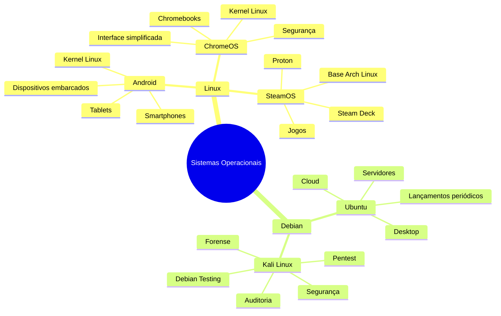

# 🖥️ Sistemas Operacionais Desenvolvidos a Partir de Outros Sistemas

> **Disciplina:** Sistemas Operacionais
> **Tema:** Sistemas Operacionais que utilizam ou se baseiam em outros sistemas
> **Formato:** Pesquisa comparativa

---

## 📚 1. Introdução

Os sistemas operacionais modernos raramente são desenvolvidos completamente do zero. Muitos projetos utilizam como ponto de partida tecnologias já consolidadas, como **kernels**, bibliotecas, ferramentas, sistemas de gerenciamento de pacotes ou estruturas de distribuição.

Um exemplo bastante conhecido é o **Android**, cuja plataforma tem como fundamento o **kernel Linux**. Outro exemplo é o **Ubuntu**, que é desenvolvido a partir do **Debian**, compartilhando diversos pacotes, ferramentas e técnicas.

Nesta pesquisa foram selecionados cinco sistemas operacionais que possuem uma relação direta com outro sistema ou projeto:

1. 📱 Android → Linux
2. 🟠 Ubuntu → Debian
3. 🌐 ChromeOS → Linux
4. 🎮 SteamOS → Arch Linux
5. 🔐 Kali Linux → Debian

O objetivo é identificar a base utilizada por cada sistema e comparar suas principais características e diferenças.

---

# 🧠 2. Mapa mental



---

# 🔎 3. Sistemas Operacionais pesquisados

## 📱 3.1 Android

O **Android** é uma plataforma de software de código aberto baseada em Linux. O **kernel Linux** constitui a fundação da plataforma, fornecendo funcionalidades de baixo nível, como gerenciamento de memória e processos.

Entretanto, Android não é simplesmente uma distribuição Linux tradicional. Sobre o kernel existe uma arquitetura própria, composta por elementos como **HAL (Hardware Abstraction Layer)**, **Android Runtime (ART)**, bibliotecas nativas e framework de APIs.

Além disso, o projeto utiliza versões LTS do kernel Linux combinadas com modificações específicas para Android, formando os chamados **Android Common Kernels (ACKs)**.

### 🧩 Relação com Linux

```text
Linux Kernel
     ↓
Android Common Kernel
     ↓
HAL + Bibliotecas
     ↓
Android Runtime (ART)
     ↓
Framework Android
     ↓
Aplicativos
```

### ⭐ Principais diferenças

* 📱 Focado em dispositivos móveis e diferentes fatores de forma.
* 🔐 Possui mecanismos específicos de segurança para dispositivos móveis.
* ⚙️ Utiliza o Android Runtime (ART).
* 🔌 Possui uma camada de abstração de hardware (HAL).
* 🧩 Utiliza modificações específicas no kernel Linux.
* 👆 Possui uma interface e APIs voltadas principalmente para dispositivos móveis.

**Fonte:** documentação oficial do Android.

---

# 🟠 3.2 Ubuntu

O **Ubuntu** é um sistema operacional baseado no **Debian GNU/Linux**. O próprio projeto Ubuntu afirma que o Debian é a base sobre a qual o Ubuntu é construído.

Ubuntu e Debian compartilham diversos pacotes, ferramentas e técnicas. Porém, o Ubuntu possui objetivos e processos próprios, incluindo seu ciclo de lançamentos, foco em usabilidade e suporte para desktop, servidores e cloud.

### 🧩 Relação com Debian

```text
Debian
  │
  ├── Pacotes
  ├── APT
  ├── Ferramentas
  └── Infraestrutura
        ↓
      Ubuntu
        ↓
 ┌──────┼────────┐
Desktop  Server   Cloud
```

### ⭐ Principais diferenças

* 🖥️ Maior foco em facilidade de uso.
* 📅 Possui calendário próprio de lançamentos.
* 🛡️ Possui versões LTS com suporte prolongado.
* 📦 Utiliza o sistema de gerenciamento de pacotes APT.
* ☁️ Possui forte foco em servidores e computação em nuvem.
* 🧑‍💻 Possui uma comunidade e infraestrutura de desenvolvimento próprias.

O Ubuntu também importa mudanças do Debian por meio de processos de *sync* e *merge*.

---

# 🌐 3.3 ChromeOS

O **ChromeOS** utiliza o **kernel Linux** como parte fundamental de sua arquitetura. Historicamente, o ChromiumOS — projeto relacionado ao ChromeOS — utilizou inicialmente um kernel baseado em Ubuntu, mas posteriormente passou a acompanhar diretamente o kernel Linux upstream, adicionando modificações próprias quando necessário.

O sistema foi desenvolvido com foco em computadores Chromebook e prioriza características como:

* 🔒 Segurança;
* ⚡ Inicialização e funcionamento simplificados;
* 🌐 Integração com serviços web;
* 💻 Computadores de baixo consumo;
* 🐧 Compatibilidade com aplicações Linux.

Atualmente, o ChromeOS também permite executar aplicativos Linux por meio de um ambiente baseado em contêineres, conhecido como **Linux on ChromeOS/Crostini**.

### 🧩 Relação com Linux

```text
        Linux Kernel
             ↓
        ChromeOS
       /    |     \
 Segurança Web   Interface
       \    |     /
        Chromebook
```

### ⭐ Principais diferenças

* 🌐 Forte integração com tecnologias web.
* 💻 Projetado principalmente para Chromebooks.
* 🔒 Arquitetura voltada para segurança e simplicidade.
* 🐧 Permite executar aplicativos Linux em contêineres.
* 🎨 Possui uma experiência de usuário diferente de uma distribuição Linux tradicional.

---

# 🎮 3.4 SteamOS

O **SteamOS** é uma distribuição Linux desenvolvida pela Valve com foco em jogos.

Segundo a própria Valve, o SteamOS é uma distribuição **baseada no Arch Linux**. O sistema combina os componentes de base do Arch com modificações e componentes desenvolvidos para proporcionar uma experiência otimizada para jogos.

Um dos exemplos mais conhecidos de utilização do SteamOS é o **Steam Deck**.

### 🧩 Relação com Arch Linux

```text
              Arch Linux
                  ↓
             SteamOS
          ↙      ↓       ↘
      Linux    Steam    Proton
       Base    Client   Compatibilidade
          \      |       /
             🎮 Jogos
```

### ⭐ Principais diferenças

| Característica   | Arch Linux              | SteamOS                             |
| ---------------- | ----------------------- | ----------------------------------- |
| 🎯 Objetivo      | Uso geral               | Jogos                               |
| 🐧 Base          | Linux                   | Arch Linux                          |
| 🖥️ Interface    | Personalizável          | Otimizada para jogos                |
| 🎮 Steam         | Pode ser instalado      | Elemento central                    |
| 🔧 Atualizações  | Modelo do Arch          | Adaptado pela Valve                 |
| 🕹️ Hardware     | Diversos equipamentos   | Especialmente dispositivos de jogos |
| 🪟 Jogos Windows | Depende da configuração | Proton integrado                    |

O SteamOS também utiliza o **Proton**, camada de compatibilidade da Valve que permite executar muitos jogos originalmente desenvolvidos para Windows.

---

# 🔐 3.5 Kali Linux

O **Kali Linux** é uma distribuição Linux voltada principalmente para **testes de intrusão, auditoria de segurança, pesquisa de segurança e computação forense**.

Sua base é o **Debian**. Atualmente, o Kali é baseado no **Debian Testing**, importando grande parte de seus pacotes dos repositórios Debian. Alguns pacotes são modificados ou desenvolvidos especificamente para atender às necessidades do Kali.

Historicamente, o Kali sucedeu o BackTrack. O BackTrack utilizou diferentes bases ao longo de sua história, enquanto o Kali passou a utilizar Debian a partir de sua primeira versão em 2013.

### 🧩 Relação com Debian

```text
             Debian Testing
                   ↓
              Kali Linux
        ┌──────────┼──────────┐
        ↓          ↓          ↓
     Pentest    Forense   Auditoria
        ↓          ↓          ↓
        └──── Segurança ──────┘
```

### ⭐ Principais diferenças

| Característica              | Debian                  | Kali Linux                 |
| --------------------------- | ----------------------- | -------------------------- |
| 🎯 Objetivo                 | Uso geral               | Segurança                  |
| 📦 Base                     | Debian                  | Debian Testing             |
| 🔐 Ferramentas de segurança | Não é o foco principal  | Centenas de ferramentas    |
| 🖥️ Público-alvo            | Usuários diversos       | Profissionais de segurança |
| 🔄 Atualizações             | Stable/Testing/Unstable | Rolling                    |
| 🧪 Pentest                  | Ferramentas instaláveis | Ferramentas integradas     |

O projeto Kali informa que a distribuição possui centenas de ferramentas, configurações e scripts voltados à segurança da informação.

---

# 📊 4. Tabela comparativa geral

| 🖥️ Sistema       | 🧱 Sistema/Base de origem | 🔧 Tipo de relação           | 🎯 Principal finalidade     | ⭐ Principal diferença                                       |
| ----------------- | ------------------------- | ---------------------------- | --------------------------- | ----------------------------------------------------------- |
| 📱 **Android**    | Linux                     | Utiliza o kernel Linux       | Dispositivos móveis         | Possui arquitetura Android, ART, HAL e componentes próprios |
| 🟠 **Ubuntu**     | Debian                    | Distribuição derivada        | Desktop, servidores e cloud | Foco em facilidade de uso, suporte e ciclos próprios        |
| 🌐 **ChromeOS**   | Linux                     | Utiliza o kernel Linux       | Chromebooks                 | Experiência simplificada e foco em segurança/web            |
| 🎮 **SteamOS**    | Arch Linux                | Distribuição baseada no Arch | Jogos                       | Otimizado para Steam e dispositivos de jogos                |
| 🔐 **Kali Linux** | Debian Testing            | Distribuição derivada        | Segurança da informação     | Ferramentas integradas para pentest e auditoria             |

---

# 🔬 5. Comparação detalhada

| Critério                    | Android         | Ubuntu                   | ChromeOS                  | SteamOS                  | Kali Linux                 |
| --------------------------- | --------------- | ------------------------ | ------------------------- | ------------------------ | -------------------------- |
| 🧱 Base                     | Linux Kernel    | Debian                   | Linux Kernel              | Arch Linux               | Debian Testing             |
| 🐧 Utiliza Linux            | ✅               | ✅                        | ✅                         | ✅                        | ✅                          |
| 🎯 Público principal        | Usuários móveis | Usuários gerais/empresas | Usuários de Chromebook    | Gamers                   | Profissionais de segurança |
| 📱 Mobile                   | ⭐⭐⭐             | ⭐                        | ⭐                         | ❌                        | ⭐                          |
| 🖥️ Desktop                 | ⭐⭐              | ⭐⭐⭐                      | ⭐⭐⭐                       | ⭐⭐                       | ⭐⭐                         |
| 🎮 Jogos                    | ⭐⭐              | ⭐⭐                       | ⭐⭐                        | ⭐⭐⭐                      | ⭐                          |
| 🔐 Segurança                | ⭐⭐⭐             | ⭐⭐⭐                      | ⭐⭐⭐                       | ⭐⭐                       | ⭐⭐⭐                        |
| 🧪 Pentest                  | ❌               | ⚠️                       | ⚠️                        | ❌                        | ⭐⭐⭐                        |
| ☁️ Servidores               | ⚠️              | ⭐⭐⭐                      | ❌                         | ❌                        | ⭐                          |
| 🔄 Modelo de atualização    | Próprio         | Próprio                  | Próprio                   | Adaptado                 | Rolling                    |
| 📦 Gerenciamento de pacotes | Próprio/Android | APT + outros             | Próprio + Linux container | Pacman/estrutura própria | APT                        |
| 🧩 Personalização da base   | Alta            | Alta                     | Alta, mas controlada      | Alta                     | Alta                       |

> **Legenda:** ⭐⭐⭐ = muito relevante · ⭐⭐ = relevante · ⭐ = possível/menos relevante · ❌ = não é o objetivo principal · ⚠️ = possível, mas não é o foco.

---

# 🧬 6. Como os sistemas estão relacionados?

Podemos representar as relações de dependência da seguinte forma:

```text
                         ┌────────────────┐
                         │  LINUX KERNEL  │
                         └───────┬────────┘
                                 │
                ┌────────────────┼────────────────┐
                │                │                │
                ▼                ▼                ▼
           📱 Android       🌐 ChromeOS       🐧 Linux
                                                   │
                                                   │
                           ┌───────────────────────┼──────────────────┐
                           │                                          │
                           ▼                                          ▼
                       Debian                                      Arch Linux
                           │                                          │
                     ┌─────┴─────┐                                    │
                     │           │                                    │
                     ▼           ▼                                    ▼
                 🟠 Ubuntu   🔐 Kali Linux                       🎮 SteamOS
```

### 🧠 Interpretação

* **Android** utiliza o Linux como fundação de seu kernel.
* **ChromeOS** também utiliza o kernel Linux.
* **Ubuntu** utiliza o Debian como base de sua distribuição.
* **Kali Linux** utiliza o Debian Testing como base.
* **SteamOS** utiliza o Arch Linux como base.

Portanto, podemos perceber que existe uma espécie de **árvore de evolução e reaproveitamento tecnológico**.

---

# 💡 7. O que podemos aprender com esses exemplos?

A análise mostra que utilizar uma base existente pode trazer diversas vantagens:

### ✅ Vantagens

* 🧑‍💻 Aproveitamento de código já desenvolvido.
* 🔒 Uso de mecanismos de segurança já testados.
* 🛠️ Reutilização de ferramentas e bibliotecas.
* 👥 Aproveitamento de comunidades existentes.
* ⚡ Redução do tempo necessário para desenvolvimento.
* 🧩 Possibilidade de especializar o sistema para determinado público.

### ⚠️ Desvantagens

* 🔗 Dependência tecnológica da base.
* 🔄 Necessidade de acompanhar atualizações do projeto original.
* 🐛 Possibilidade de herdar problemas ou limitações.
* 🧩 Manutenção de modificações próprias.
* 📦 Possíveis incompatibilidades entre versões.

---

# 📝 8. Conclusão

A pesquisa demonstra que muitos sistemas operacionais conhecidos possuem uma relação direta com outros projetos.

O **Android** e o **ChromeOS** utilizam o **kernel Linux** como parte fundamental de sua arquitetura, mas acrescentam componentes próprios para atender aos seus objetivos.

Já o **Ubuntu** e o **Kali Linux** são exemplos de distribuições que utilizam o **Debian** como base. Apesar disso, cada um possui objetivos bastante diferentes: o Ubuntu busca oferecer uma plataforma de uso geral, enquanto o Kali é especializado em segurança da informação.

O **SteamOS**, por sua vez, demonstra como uma distribuição pode utilizar outra como ponto de partida e adaptá-la para uma finalidade específica. Nesse caso, o Arch Linux serve como base para uma plataforma otimizada para jogos.

Dessa forma, percebe-se que o desenvolvimento de sistemas operacionais não depende necessariamente da criação de todos os componentes desde o início. A reutilização de **kernels, pacotes, ferramentas, bibliotecas e estruturas** permite criar sistemas especializados, mantendo uma relação com projetos anteriores.

---

# 📚 9. Referências

1. **Android Developers — Arquitetura da plataforma.**
   Documentação oficial sobre a arquitetura do Android e sua relação com o kernel Linux.

2. **Android Open Source Project — Visão geral do kernel.**
   Documentação sobre Android Common Kernels e sua relação com kernels Linux LTS.

3. **Ubuntu Project — Debian.**
   Documentação oficial explicando a relação entre Debian e Ubuntu.

4. **Ubuntu Project — Merges & Syncs.**
   Documentação sobre a integração de mudanças do Debian no Ubuntu.

5. **ChromiumOS — Kernel Design.**
   Documentação sobre o uso do kernel Linux pelo ChromiumOS/ChromeOS.

6. **ChromeOS — Linux on ChromeOS.**
   Documentação sobre a execução de aplicações Linux no ChromeOS.

7. **Steam — SteamOS.**
   Página oficial da Valve sobre o SteamOS e sua base Arch Linux.

8. **Kali Linux — Relationship With Debian.**
   Documentação oficial sobre a relação do Kali Linux com o Debian Testing.

9. **Kali Linux — History.**
   Histórico das bases utilizadas pelo BackTrack e pelo Kali Linux.

---

# 🎓 10. Resumo final

| #   | Sistema       | Base           | Área principal         |
| --- | ------------- | -------------- | ---------------------- |
| 1️⃣ | 📱 Android    | Linux          | Dispositivos móveis    |
| 2️⃣ | 🟠 Ubuntu     | Debian         | Desktop/Servidor/Cloud |
| 3️⃣ | 🌐 ChromeOS   | Linux          | Chromebooks            |
| 4️⃣ | 🎮 SteamOS    | Arch Linux     | Jogos                  |
| 5️⃣ | 🔐 Kali Linux | Debian Testing | Segurança              |

> 🚀 **Conclusão em uma frase:** sistemas operacionais podem aproveitar projetos existentes como base e, a partir deles, criar soluções especializadas para diferentes públicos e necessidades.

---

**Arquivo sugerido:** `sistemas-operacionais-baseados-em-outros.md`
