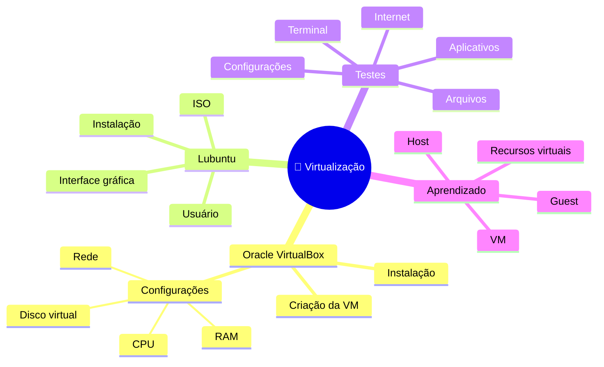
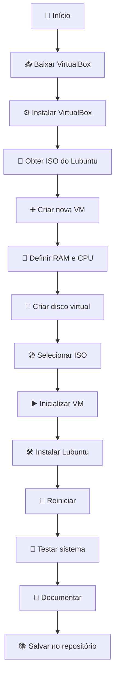
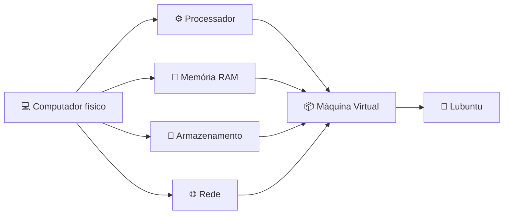
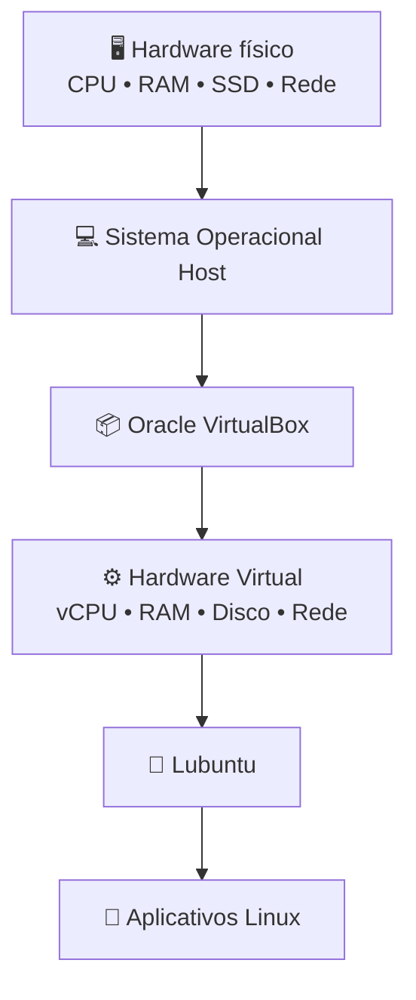
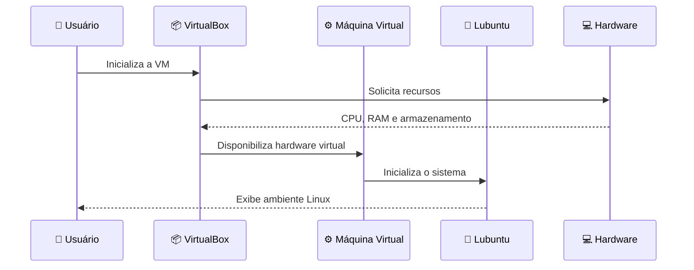
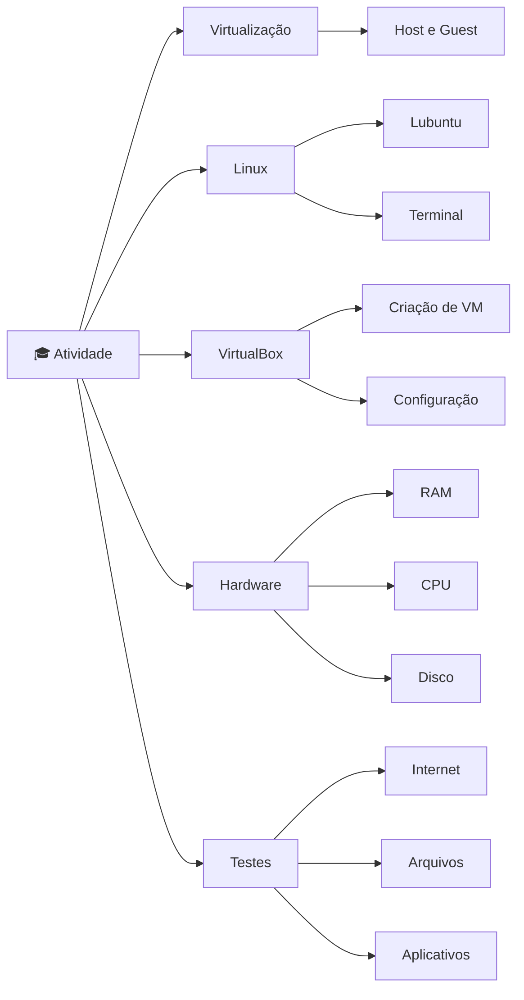

# 🐧 Manual de Instalação e Virtualização do Lubuntu no Oracle VirtualBox

> **Atividade:** Instalação, configuração e teste de uma máquina virtual
> Linux\
> **Sistema virtualizado:** Lubuntu\
> **Software de virtualização:** Oracle VirtualBox\
> **Aluno:** Bernardo Cipolli\
> **Data:** 31/08/2026

------------------------------------------------------------------------

## 📌 Sumário

1.  [Objetivo](#-objetivo)
2.  [O que é virtualização?](#-o-que-é-virtualização)
3.  [Ferramentas utilizadas](#-ferramentas-utilizadas)
4.  [Mapa mental](#-mapa-mental)
5.  [Fluxo da atividade](#-fluxo-da-atividade)
6.  [Instalação do Oracle
    VirtualBox](#-1-instalação-do-oracle-virtualbox)
7.  [Download da imagem ISO do
    Lubuntu](#-2-download-da-imagem-iso-do-lubuntu)
8.  [Criação da máquina virtual](#-3-criação-da-máquina-virtual)
9.  [Configuração da máquina
    virtual](#-4-configuração-da-máquina-virtual)
10. [Instalação do Lubuntu](#-5-instalação-do-lubuntu)
11. [Primeira inicialização](#-6-primeira-inicialização)
12. [Testes e exploração](#-7-testes-e-exploração-do-sistema)
13. [Arquitetura da virtualização](#-arquitetura-da-virtualização)
14. [Recursos da VM](#-recursos-da-máquina-virtual)
15. [Problemas e soluções](#-possíveis-problemas-e-soluções)
16. [Conclusão](#-conclusão)
17. [Checklist](#-checklist-final)

------------------------------------------------------------------------

# 🎯 Objetivo

O objetivo desta atividade foi aprender, na prática, o funcionamento da
**virtualização de sistemas operacionais**.

Para isso, foi instalado o **Oracle VirtualBox** no computador e criada
uma máquina virtual destinada à execução de uma distribuição Linux leve.

A distribuição escolhida foi o **Lubuntu**, por possuir uma interface
gráfica simples, boa usabilidade e baixo consumo de recursos quando
comparada a sistemas mais pesados.

Durante a atividade foram realizadas as seguintes etapas:

-   💻 Instalação do Oracle VirtualBox;
-   🐧 obtenção da imagem ISO do Lubuntu;
-   ⚙️ criação e configuração de uma máquina virtual;
-   💿 instalação do Lubuntu;
-   🚀 inicialização do sistema virtualizado;
-   🌐 teste de acesso à Internet;
-   📁 exploração do sistema de arquivos;
-   🖥️ teste de aplicativos;
-   🔧 exploração das configurações;
-   📝 documentação de todo o procedimento.

------------------------------------------------------------------------

# 🧠 O que é virtualização?

A **virtualização** permite executar um sistema operacional dentro de
outro sistema operacional por meio de uma máquina virtual.

No procedimento realizado nesta atividade, o computador possui o sistema
operacional principal, enquanto o **VirtualBox** funciona como o
software responsável por criar o ambiente virtual.

Dentro desse ambiente foi instalado o **Lubuntu**.

### Estrutura simplificada

``` text
┌───────────────────────────────────────┐
│            💻 Computador             │
│                                       │
│  ┌─────────────────────────────────┐  │
│  │       Sistema Operacional       │  │
│  │             Host                │  │
│  │                                 │  │
│  │  ┌───────────────────────────┐  │  │
│  │  │     Oracle VirtualBox     │  │  │
│  │  │                           │  │  │
│  │  │  ┌─────────────────────┐  │  │  │
│  │  │  │ 🐧 Lubuntu (Guest) │  │  │  │
│  │  │  └─────────────────────┘  │  │  │
│  │  └───────────────────────────┘  │  │
│  └─────────────────────────────────┘  │
└───────────────────────────────────────┘
```

### Conceitos importantes

  -----------------------------------------------------------------------
  Conceito                            Descrição
  ----------------------------------- -----------------------------------
  🖥️ **Host**                         Computador/sistema principal que
                                      executa o VirtualBox

  📦 **Máquina Virtual (VM)**         Computador simulado por software

  🐧 **Guest**                        Sistema operacional executado
                                      dentro da VM

  💿 **ISO**                          Arquivo que contém a mídia de
                                      instalação do sistema

  ⚙️ **VirtualBox**                   Hipervisor utilizado para criar e
                                      executar a VM

  💾 **Disco virtual**                Arquivo que funciona como o
                                      armazenamento da VM
  -----------------------------------------------------------------------

------------------------------------------------------------------------

# 🛠️ Ferramentas utilizadas

  Ferramenta             Utilização
  ---------------------- --------------------------------------------
  🟦 Oracle VirtualBox   Criação e execução da máquina virtual
  🐧 Lubuntu             Sistema operacional Linux instalado na VM
  💿 Imagem ISO          Mídia utilizada para instalar o Lubuntu
  🌐 Navegador           Download dos programas e teste de Internet
  🖥️ Terminal Linux      Testes e exploração do sistema

------------------------------------------------------------------------

# 🧩 Mapa mental



> ℹ️ **Observação:** plataformas compatíveis com Mermaid, como algumas
> visualizações de Markdown, podem renderizar o mapa mental acima
> automaticamente.

------------------------------------------------------------------------

# 🔄 Fluxo da atividade



------------------------------------------------------------------------

# 📥 1. Instalação do Oracle VirtualBox

O primeiro passo foi instalar o software responsável pela virtualização.

O **Oracle VirtualBox** permite criar computadores virtuais utilizando
recursos do computador físico, como memória RAM, processador,
armazenamento e conexão de rede.

### Procedimento

1.  Acessar o site oficial do Oracle VirtualBox;
2.  localizar a seção de downloads;
3.  selecionar a versão compatível com o sistema operacional;
4.  baixar o instalador;
5.  executar o arquivo;
6.  seguir as etapas apresentadas pelo assistente;
7.  manter os componentes necessários selecionados;
8.  concluir a instalação;
9.  abrir o VirtualBox.

### 📸 Evidência sugerida

Adicione uma captura do VirtualBox instalado:

``` md

```

------------------------------------------------------------------------

# 💿 2. Download da imagem ISO do Lubuntu

Após instalar o VirtualBox, foi necessário obter o instalador do sistema
operacional que seria executado na máquina virtual.

Foi escolhido o **Lubuntu**, uma distribuição Linux baseada no Ubuntu
que utiliza um ambiente gráfico leve.

### Motivos para utilizar o Lubuntu

-   🪶 baixo consumo de recursos;
-   🖥️ interface gráfica;
-   🐧 baseado em Linux/Ubuntu;
-   📚 adequado para aprendizado;
-   ⚡ bom desempenho em máquinas virtuais;
-   🧰 possui ferramentas básicas para utilização do sistema.

O arquivo baixado possui formato **`.iso`**.

Esse arquivo funciona como uma mídia de instalação virtual.

### 📸 Evidência sugerida

``` md

```

------------------------------------------------------------------------

# 🖥️ 3. Criação da máquina virtual

Com o VirtualBox instalado e a ISO disponível, foi criada uma nova
máquina virtual.

### Passos

1.  Abrir o **Oracle VirtualBox**;
2.  clicar em **Novo / New**;
3.  informar um nome para a máquina virtual, por exemplo:

``` text
Lubuntu
```

4.  selecionar a imagem ISO do Lubuntu;
5.  conferir o tipo de sistema operacional;
6.  avançar para a configuração de hardware.

### Estrutura

``` text
Oracle VirtualBox
        │
        └── 📦 Máquina Virtual
                │
                └── 🐧 Lubuntu
```

### 📸 Evidência sugerida

``` md

```

------------------------------------------------------------------------

# ⚙️ 4. Configuração da máquina virtual

Uma máquina virtual utiliza parte dos recursos disponíveis no computador
físico.

Os principais recursos configurados são:



## 🧠 Memória RAM

Foi reservada memória RAM para que o Lubuntu pudesse executar suas
aplicações.

É importante não disponibilizar toda a memória do computador para a VM,
pois o sistema principal também precisa continuar funcionando.

## ⚙️ Processadores

Também foram disponibilizados núcleos virtuais do processador.

Quanto mais recursos forem destinados à máquina virtual, maior poderá
ser seu desempenho, desde que o computador físico tenha recursos
suficientes.

## 💾 Disco rígido virtual

Foi criado um disco virtual para armazenar:

-   sistema operacional;
-   configurações;
-   programas;
-   arquivos do usuário;
-   atualizações.

O disco virtual fica armazenado no computador físico como um arquivo
utilizado pelo VirtualBox.

### Exemplo de configuração

  Recurso                      Exemplo
  ------------------ -----------------
  🧠 RAM                          4 GB
  ⚙️ CPUs virtuais                   2
  💾 Disco virtual       25 GB ou mais
  🖥️ Sistema           Lubuntu 64 bits
  🌐 Rede                          NAT

> ⚠️ Os valores acima são exemplos. A configuração pode variar de acordo
> com os recursos disponíveis no computador.

### 📸 Evidência sugerida

``` md

```

------------------------------------------------------------------------

# 🐧 5. Instalação do Lubuntu

Depois de configurar a VM, ela foi inicializada utilizando a imagem ISO.

O VirtualBox simula a inicialização de um computador real.

``` text
💻 Computador
      ↓
📦 VirtualBox
      ↓
▶️ Inicialização da VM
      ↓
💿 ISO do Lubuntu
      ↓
🐧 Instalador
      ↓
💾 Disco virtual
      ↓
✅ Lubuntu instalado
```

### Etapas realizadas

1.  iniciar a máquina virtual;
2.  aguardar o carregamento do Lubuntu;
3.  selecionar a opção de instalação;
4.  definir o idioma;
5.  configurar teclado;
6.  selecionar as opções de instalação;
7.  selecionar o disco virtual;
8.  criar usuário e senha;
9.  confirmar a instalação;
10. aguardar a cópia dos arquivos;
11. reiniciar a VM.

> ⚠️ O disco apresentado dentro da máquina virtual é um **disco
> virtual**. Dessa forma, a instalação realizada corretamente na VM não
> formata o disco físico do computador host.

### 📸 Evidências sugeridas

``` md


```

------------------------------------------------------------------------

# 🚀 6. Primeira inicialização

Depois da instalação, a máquina virtual foi reiniciada.

O Lubuntu passou a inicializar diretamente pelo disco virtual criado
anteriormente.

Após inserir usuário e senha, foi possível acessar a área de trabalho.

### Resultado esperado

``` text
┌─────────────────────────────────┐
│         🐧 LUBUNTU              │
│                                 │
│     🖥️ Área de trabalho         │
│                                 │
│ 📁 Arquivos    🌐 Internet      │
│ ⚙️ Ajustes     ⌨️ Terminal      │
│                                 │
└─────────────────────────────────┘
```

### 📸 Evidência importante

``` md

```

------------------------------------------------------------------------

# 🧪 7. Testes e exploração do sistema

Com o sistema funcionando, foram exploradas algumas funcionalidades para
verificar se a virtualização estava funcionando corretamente.

## 🌐 7.1 Teste de Internet

Foi aberto o navegador para verificar o funcionamento da conexão de
rede.

Quando configurado adequadamente, o VirtualBox permite que a máquina
virtual utilize a conexão do computador host.

**Resultado:** conexão de rede disponível para utilização do sistema.

------------------------------------------------------------------------

## 📁 7.2 Gerenciador de arquivos

O gerenciador de arquivos foi explorado para visualizar diretórios e
entender a organização do sistema Linux.

Alguns diretórios comuns são:

``` text
/
├── bin
├── boot
├── dev
├── etc
├── home
│   └── usuario
├── media
├── opt
├── tmp
├── usr
└── var
```

O diretório `/home` normalmente contém os arquivos pessoais dos
usuários.

------------------------------------------------------------------------

## ⌨️ 7.3 Terminal

O terminal é uma ferramenta importante no Linux.

Alguns comandos básicos podem ser utilizados para explorar o sistema:

``` bash
pwd
```

Mostra o diretório atual.

``` bash
ls
```

Lista arquivos e diretórios.

``` bash
cd
```

Permite navegar entre diretórios.

``` bash
whoami
```

Mostra o usuário atual.

``` bash
uname -a
```

Apresenta informações sobre o sistema e o kernel.

``` bash
free -h
```

Mostra informações sobre utilização de memória.

``` bash
df -h
```

Mostra informações sobre armazenamento.

------------------------------------------------------------------------

## 🖥️ 7.4 Interface gráfica

Também foram explorados:

-   menu de aplicativos;
-   área de trabalho;
-   painel;
-   configurações;
-   gerenciador de arquivos;
-   navegador;
-   terminal;
-   opções de desligamento e reinicialização.

------------------------------------------------------------------------

## 📊 Resultado dos testes

  Teste                         Resultado esperado
  ----------------------------- --------------------
  🐧 Inicialização do Lubuntu   ✅ Funcionando
  🖥️ Interface gráfica          ✅ Funcionando
  ⌨️ Teclado                    ✅ Funcionando
  🖱️ Mouse                      ✅ Funcionando
  🌐 Internet                   ✅ Funcionando
  📁 Gerenciador de arquivos    ✅ Funcionando
  ⌨️ Terminal                   ✅ Funcionando
  🔄 Reinicialização            ✅ Funcionando

### 📸 Evidências sugeridas

``` md


```

------------------------------------------------------------------------

# 🏗️ Arquitetura da virtualização

O ambiente criado pode ser representado da seguinte forma:



O VirtualBox atua como uma camada entre o computador principal e o
sistema convidado.

------------------------------------------------------------------------

# 📊 Recursos da máquina virtual

Uma forma simplificada de compreender a divisão de recursos é:

``` text
RECURSOS DO COMPUTADOR
████████████████████████████████████

Sistema Host
████████████████████████

Máquina Virtual
████████████

Dentro da VM:
├── 🧠 RAM virtual
├── ⚙️ CPU virtual
├── 💾 Disco virtual
├── 🌐 Adaptador de rede virtual
└── 🖥️ Adaptador gráfico virtual
```

A VM não é um computador físico separado, porém, para o sistema
operacional convidado, os recursos virtuais funcionam de maneira
semelhante aos componentes de um computador real.

------------------------------------------------------------------------

# 🔗 Comunicação entre os componentes



------------------------------------------------------------------------

# ⚖️ Sistema físico x Máquina virtual

  Característica   Sistema físico      Máquina virtual
  ---------------- ------------------- -------------------
  Hardware         Real                Virtualizado
  CPU              Física              vCPU
  Memória          RAM física          RAM reservada
  Armazenamento    SSD/HD              Disco virtual
  Rede             Adaptador físico    Adaptador virtual
  Sistema          Host                Guest
  Isolamento       Sistema principal   Ambiente separado
  Flexibilidade    Menor               Alta

------------------------------------------------------------------------

# 🌟 Vantagens da virtualização

A atividade permitiu observar diversas vantagens.

### 🔒 Isolamento

O sistema convidado funciona em um ambiente separado do sistema
principal.

### 🧪 Testes

É possível testar sistemas operacionais e softwares sem precisar
substituir o sistema instalado fisicamente.

### 🖥️ Vários sistemas

Um computador pode executar diferentes sistemas operacionais utilizando
máquinas virtuais.

### 📚 Aprendizado

A virtualização facilita estudos de:

-   Linux;
-   redes;
-   servidores;
-   sistemas operacionais;
-   desenvolvimento;
-   administração de sistemas.

### 🔄 Flexibilidade

Uma VM pode ser desligada, modificada, clonada ou removida sem precisar
alterar diretamente a instalação principal do computador.

------------------------------------------------------------------------

# ⚠️ Possíveis problemas e soluções

  -----------------------------------------------------------------------
  Problema                            Possível solução
  ----------------------------------- -----------------------------------
  VM muito lenta                      Aumentar RAM/CPU dentro dos limites
                                      do host

  Lubuntu não inicia                  Conferir ISO e ordem de
                                      inicialização

  Sem Internet                        Conferir adaptador de rede/NAT

  Tela pequena                        Ajustar resolução e recursos de
                                      integração

  Pouco armazenamento                 Aumentar o disco virtual quando
                                      aplicável

  Virtualização indisponível          Verificar suporte/configuração de
                                      virtualização do computador

  ISO não encontrada                  Conferir o caminho do arquivo
                                      `.iso`
  -----------------------------------------------------------------------

------------------------------------------------------------------------

# 🔐 Boas práticas

Durante a utilização de máquinas virtuais é recomendado:

-   não reservar todos os recursos do computador para uma única VM;
-   utilizar imagens ISO obtidas de fontes confiáveis;
-   manter espaço disponível no armazenamento;
-   desligar corretamente o sistema convidado;
-   manter senhas de usuário protegidas;
-   verificar as configurações antes de alterar discos virtuais;
-   criar snapshots antes de testes importantes, quando necessário.

------------------------------------------------------------------------

# 📚 O que foi aprendido?



A atividade possibilitou compreender melhor a relação entre **hardware
físico, sistema host, hipervisor, hardware virtual e sistema
convidado**.

------------------------------------------------------------------------

# 📝 Conclusão

A instalação do **Lubuntu no Oracle VirtualBox** permitiu colocar em
prática os conceitos de virtualização apresentados durante as aulas.

Foi possível acompanhar todas as etapas, desde a preparação do software
de virtualização até a criação da máquina virtual, configuração dos
recursos, instalação do sistema operacional e realização de testes.

O Lubuntu mostrou-se adequado para a atividade por ser uma distribuição
Linux relativamente leve e possuir interface gráfica, permitindo
explorar o sistema de maneira simples.

Além da instalação, a atividade ajudou a compreender conceitos como
**host, guest, imagem ISO, memória virtual, processador virtual, disco
virtual e adaptador de rede virtual**.

Por fim, os testes realizados demonstraram como uma máquina virtual pode
ser utilizada para aprendizado, testes e execução de outros sistemas
operacionais sem a necessidade de substituir diretamente o sistema
principal do computador.

------------------------------------------------------------------------

# ✅ Checklist final

-   [x] Oracle VirtualBox instalado
-   [x] Distribuição Linux escolhida
-   [x] Lubuntu utilizado
-   [x] Imagem ISO obtida
-   [x] Máquina virtual criada
-   [x] Recursos da VM configurados
-   [x] Lubuntu instalado
-   [x] Sistema inicializado
-   [x] Interface explorada
-   [x] Terminal testado
-   [x] Gerenciador de arquivos explorado
-   [x] Rede testada
-   [x] Processo documentado
-   [ ] Capturas de tela adicionadas ao repositório
-   [ ] Manual enviado ao repositório da disciplina

------------------------------------------------------------------------

# 📂 Estrutura recomendada para o repositório

``` text
📦 atividade-virtualizacao
│
├── 📄 README.md
│
└── 📁 imagens
    ├── 01-virtualbox.png
    ├── 02-lubuntu-iso.png
    ├── 03-criacao-vm.png
    ├── 04-hardware-vm.png
    ├── 05-instalador.png
    ├── 06-instalacao.png
    ├── 07-desktop-lubuntu.png
    ├── 08-internet.png
    ├── 09-terminal.png
    └── 10-arquivos.png
```

## 📷 Como inserir suas próprias imagens

Salve as capturas dentro da pasta `imagens` e utilize:

``` md

```

Exemplo:

``` md

```

------------------------------------------------------------------------

## 🏁 Resultado final

**Oracle VirtualBox + Lubuntu = ambiente Linux virtualizado funcionando
com sucesso.** 🐧✅

> 📌 Este manual documenta o processo de criação, instalação e
> exploração da máquina virtual desenvolvido para a atividade da
> disciplina.
